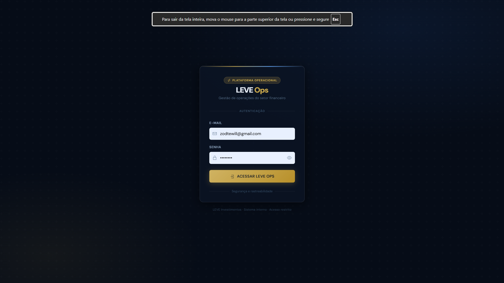
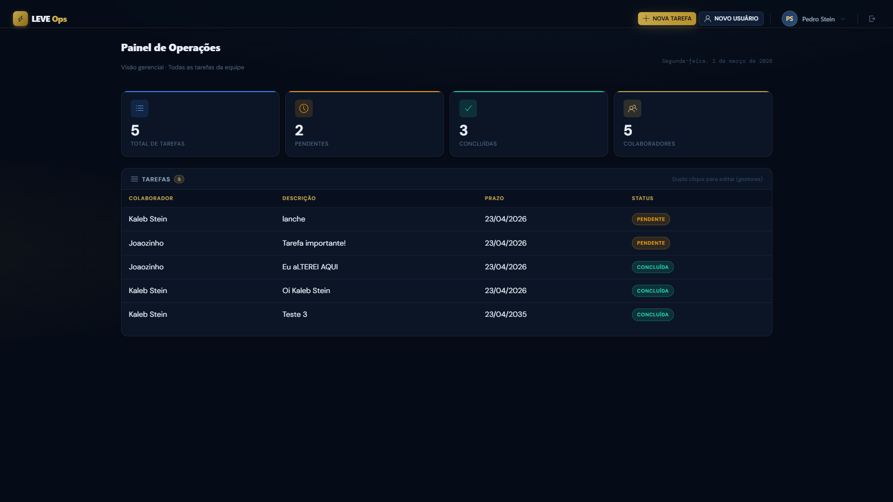
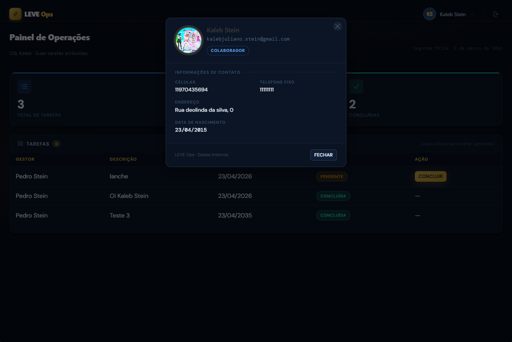
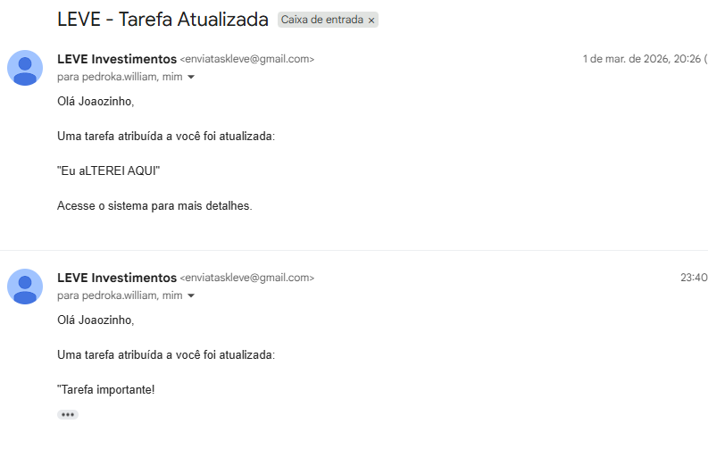

# LEVE Ops — Sistema de Gestão Operacional (Monorepo)

> Desafio técnico — **LEVE Investimentos**  
> Sistema web interno para **gestão de tarefas operacionais**, com autenticação, controle de acesso e notificações por e-mail.


---

## 📌 Visão geral

O **LEVE Ops** permite que gestores atribuam tarefas, acompanhem prazos e organizem o fluxo operacional com **status**, **dashboard** e **notificações automáticas por e-mail**.

### Principais objetivos
- Centralizar a gestão de tarefas do setor operacional
- Separar responsabilidades por perfil (Gestor x Colaborador)
- Garantir segurança de sessão e permissões por rota/ação
- Automatizar comunicação via e-mail para eventos do fluxo

---

## ✅ Entregas (Features)

- **Autenticação (JWT):** sessão segura, expiração e proteção de rotas
- **Controle de acesso (RBAC):**
  - **Gestor:** administra usuários e tarefas
  - **Colaborador:** visualiza e conclui tarefas
- **Gestão de tarefas:** criação, edição e acompanhamento de status  
  - validação de datas (**sem datas retroativas**)
- **Notificações por e-mail (Nodemailer):**
  - nova tarefa
  - tarefa editada
  - tarefa concluída
- **Dashboard dinâmico:** cards com estatísticas atualizando em tempo real
- **Foto de perfil:** upload com compressão em **Base64 no cliente**

---

## 🧱 Arquitetura do Monorepo

Estrutura em monorepo com **Back-end (API REST)** e **Front-end (SPA)** no mesmo repositório.

```txt
/
├─ backend/               # Node.js + Express + TypeScript + Prisma
│  ├─ prisma/
│  ├─ src/
│  ├─ package.json
│  └─ ...
├─ frontend/              # TypeScript (DOM/Vanilla) + UIKit
│  ├─ src/
│  ├─ public/
│  └─ ...
└─ docs/                  # imagens do README
````

---

## 🧰 Stack

### Back-end

* **Node.js + Express + TypeScript**
* **Prisma ORM**
* **SQL Server (Docker)**
* **Zod** (validação)
* **JWT + Bcrypt** (segurança)
* **Nodemailer** (notificações)

### Front-end

* **TypeScript (DOM/Vanilla)** com wrappers genéricos (`HttpClient`, `DataGrid`)
* **UIKit CSS** (requisito do desafio), customizado via variáveis CSS (Navy & Gold)

---

## 🖼️ Screenshots

### 1) Autenticação



### 2) Visão do Gestor (Dashboard & Stats)



### 3) Visão do Colaborador



### 4) Notificações por E-mail



---

## ▶️ Como executar localmente

### Pré-requisitos

* **Node.js** (v18+)
* **Git**
* **Docker + Docker Compose** (recomendado para o banco)

---

### 1) Clonar o repositório

```bash
git clone https://github.com/SEU_USUARIO/leve-investimentos.git
cd leve-investimentos
```

---

### 2) Subir o SQL Server (Docker)

A infraestrutura do banco está dockerizada para facilitar a avaliação:

```bash
docker compose up -d
```

> Aguarde alguns segundos até o container ficar pronto para conexões (healthcheck).

---

### 2.2) Alternativa: Executando sem Docker (Local)

Se preferir não utilizar a infraestrutura em container, você precisará de uma instância do **SQL Server** rodando na sua máquina.

1. Abra o seu gerenciador de banco de dados (ex: SSMS ou DBeaver).
2. Crie um banco de dados vazio chamado exatamente `LeveDB`.
3. Crie o arquivo **`backend/.env`**. Copie todo o bloco base abaixo e **escolha apenas uma** das opções de `DATABASE_URL`, dependendo de como o seu SQL Server está configurado:

```env
# ==========================================
# ESCOLHA A OPÇÃO DE DATABASE_URL ADEQUADA:
# ==========================================

# OPÇÃO A: Autenticação padrão com usuário 'sa' (Altere a senha se necessário)
DATABASE_URL="sqlserver://localhost:1433;database=LeveDB;user=sa;password=LevePassword123!;encrypt=true;trustServerCertificate=true"

# OPÇÃO B: Autenticação do Windows (Geralmente instâncias SQLEXPRESS)
# DATABASE_URL="sqlserver://localhost\SQLEXPRESS;database=LeveDB;integratedSecurity=true;encrypt=true;trustServerCertificate=true"


Crie o arquivo **`backend/.env`** com:

```env
DATABASE_URL="sqlserver://localhost:1433;database=LeveDB;user=sa;password=LevePassword123!;encrypt=true;trustServerCertificate=true"
JWT_SECRET="super_secret_jwt_key_leve_2026"
PORT=3333
NODE_ENV="production"
EMAIL_USER="enviataskleve@gmail.com"
EMAIL_PASS="" EU MANDEI NO EMAIL JUNTAMeNTE COM O LINK DO GIT
```

> `EMAIL_PASS`: idealmente usar **senha de app** (a mesma informada na entrega).

---

### 3) Instalar e rodar o Back-end

```bash
cd backend
npm install
npx prisma generate
npx prisma migrate deploy
npm run seed
```

**Produção:**

```bash
npm run build
npm start
```

**Desenvolvimento:**

```bash
npm run dev
```

A API sobe em:

* `http://localhost:3333`

---

### 4) Rodar o Front-end

Em outro terminal:

```bash
cd frontend
npx tsc -w
```

Sirva os arquivos estáticos (exemplo com `serve`):

```bash
npm install 
npx serve . -p 3000
```

Acesse:

* `http://localhost:3000`

> Alternativa: usar Live Server no VS Code apontando para `frontend/`.

---

## 🔑 Credenciais (Seed)

Usuário gestor criado automaticamente:

* **E-mail:** `ti@leveinvestimentos.com.br`
* **Senha:** `teste123`

---

## 👤 Autor

Desenvolvido por **Pedro Stein**.
